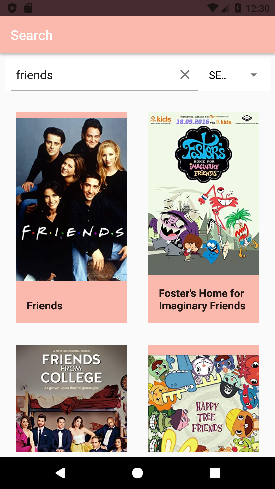
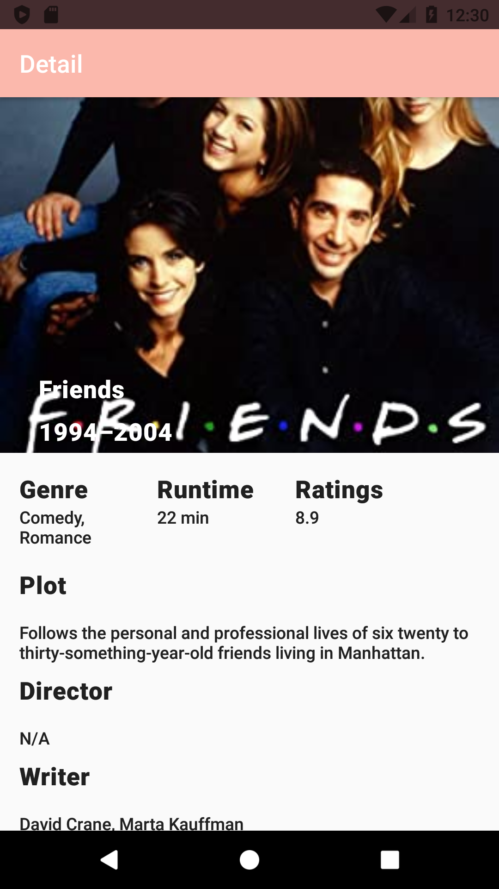
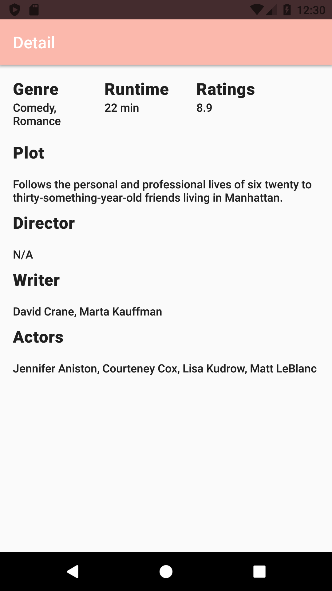

# Movies Information - using Open Movie Database - OMDB
### UI - Material Design Palette - [Palette generated by Material Palette](https://materialpalette.com/)

<!-- Palette generated by Material Palette - materialpalette.com/ -->

## App Search Screen
 
 

## App Detail Screen - WIP
 
 

## Movie Info App

